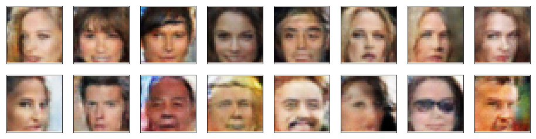

# Project Overview

Project has made during passing `Deep Learning` Nanodegree program at [Udacity](https://www.udacity.com)

# Results

Having this project done I learned how to use Generative Adversarial Networks (GANs) for image generation.

Model has trained on [CelebFaces Attributes Dataset](http://mmlab.ie.cuhk.edu.hk/projects/CelebA.html)

As a reult I have managed to generate human faces like below:

# Summary

As a result of completing this project I learned how GANs can be applied for the particular problem of generating human faces.
